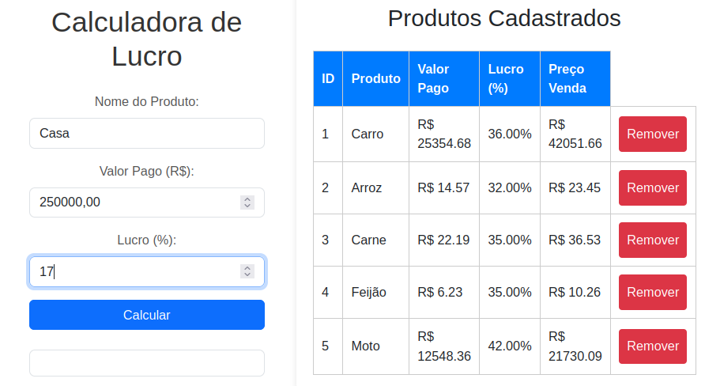

# Calculadora de Lucro e Preço de Venda

> Um projeto web simples para calcular o preço de venda de um produto com base no seu custo, margem de lucro desejada e impostos (ICMS). A aplicação salva um histórico de todos os produtos calculados e permite a sua visualização e exclusão.

**Veja a demonstração ao vivo:** [vinicius.pythonanywhere.com](http://vinicius.pythonanywhere.com/)


---

## ✨ Funcionalidades

* **Calcular Preço de Venda:** Informa o preço de venda ideal com base no valor pago, percentual de lucro e alíquota de ICMS.
* **Histórico de Produtos:** Cada cálculo é salvo em um banco de dados para referência futura.
* **Listagem Dinâmica:** A lista de produtos cadastrados na interface é atualizada em tempo real.
* **Exclusão de Produtos:** Permite remover itens do histórico através da interface.
* **API RESTful:** O backend expõe endpoints claros para todas as operações (Criar, Ler, Deletar).

---

## 🛠️ Tecnologias Utilizadas

* **Backend:** Python, Flask, Flask-SQLAlchemy
* **Frontend:** HTML5, CSS3, JavaScript (Fetch API)
* **Banco de Dados:** SQLite (para desenvolvimento local), PostgreSQL (em produção)
* **Servidor de Produção:** Gunicorn
* **Hospedagem:** PythonAnywhere

---

## 🚀 Como Rodar o Projeto Localmente

Siga os passos abaixo para executar a aplicação na sua máquina.

1.  **Clone o repositório:**
    ```bash
    git clone [https://github.com/ViniLara25/calculadora-lucro.git](https://github.com/ViniLara25/calculadora-lucro.git)
    cd calculadora-lucro
    ```

2.  **Crie e ative um ambiente virtual:**
    ```bash
    # Para Linux/macOS
    python3 -m venv venv
    source venv/bin/activate

    # Para Windows
    python -m venv venv
    .\venv\Scripts\activate
    ```

3.  **Instale as dependências:**
    ```bash
    pip install -r requirements.txt
    ```

4.  **Execute a aplicação:**
    ```bash
    python app.py
    ```

5.  Abra seu navegador e acesse: `http://127.0.0.1:5000/`

---

## 📚 Endpoints da API

A aplicação expõe os seguintes endpoints:

#### `POST /calcular`

Calcula o preço de venda e salva o produto no banco de dados.

* **Request Body (JSON):**
    ```json
    {
        "produto": "Nome do Produto",
        "valor": 100.00,
        "lucro": 25.0
    }
    ```

* **Success Response (JSON):**
    ```json
    {
        "item": "Nome do Produto",
        "valor_pago": 100.0,
        "margem_lucro": 25.0,
        "imposto_icms": 18.0,
        "preco_venda_sugerido": 175.43,
        "valor_icms_descontado": 31.57,
        "valor_liquido": 143.86,
        "lucro_final": 43.86
    }
    ```

#### `GET /produtos`

Retorna uma lista de todos os produtos cadastrados.

* **Success Response (JSON):**
    ```json
    [
        {
            "id": 1,
            "nome": "Produto Exemplo",
            "valor_pago": 100.0,
            "margem_lucro": 25.0,
            "preco_venda_sugerido": 175.43,
            "valor_icms_descontado": 31.57,
            "valor_liquido": 143.86,
            "lucro_final": 43.86
        }
    ]
    ```

#### `DELETE /produtos/<int:produto_id>`

Deleta um produto específico pelo seu `id`.

* **Success Response (JSON):**
    ```json
    {
        "mensagem": "Produto deletado com sucesso!"
    }
    ```

---

## 📄 Licença

Este projeto está sob a licença MIT. Veja o arquivo [LICENSE](LICENSE) para mais detalhes.
